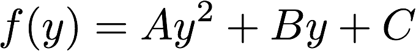
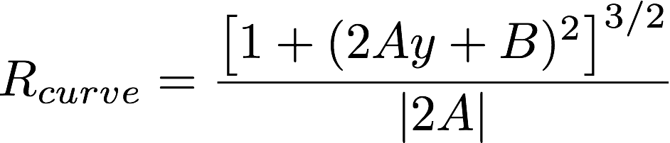

##Writeup Template
###You can use this file as a template for your writeup if you want to submit it as a markdown file, but feel free to use some other method and submit a pdf if you prefer.

---

**Advanced Lane Finding Project**

The goals / steps of this project are the following:

* Compute the camera calibration matrix and distortion coefficients given a set of chessboard images.
* Apply a distortion correction to raw images.
* Use color transforms, gradients, etc., to create a thresholded binary image.
* Apply a perspective transform to rectify binary image ("birds-eye view").
* Detect lane pixels and fit to find the lane boundary.
* Determine the curvature of the lane and vehicle position with respect to center.
* Warp the detected lane boundaries back onto the original image.
* Output visual display of the lane boundaries and numerical estimation of lane curvature and vehicle position.

[//]: # (Image References)

[image1]: ./output_images/undistortion_checkborad.png "Undistorted checkboard"
[image2]: ./output_images/undistortion.png "undistorted test image"
[image3]: ./output_images/threshold.png "Binary Example"
[image4]: ./output_images/perspective_transform.png "Warp Example"
[image5]: ./output_images/left_right_line.png "left and right lane lines"
[image6]: ./output_images/fit_lane_lines.png "fit lane lines"
[image7]: ./output_images/result_image.png "lane highlighted image"
[video1]: ./project_video.mp4 "Video"

## [Rubric](https://review.udacity.com/#!/rubrics/571/view) Points
###Here I will consider the rubric points individually and describe how I addressed each point in my implementation.  

---

### Camera Calibration

#### 1. Briefly state how you computed the camera matrix and distortion coefficients. Provide an example of a distortion corrected calibration image.

The camera calibration step is aim to remove the image distortion from the camera. In order to calibrate the camera, several check board images are taken using the same camera and are placed in the folder `./cameral_cal/`. The distortion parameters are calculated using function

```
dist_mtx,dist_param = camera_cal_parameters(cal_images,image_size)
```

These parameters can then be used to correct the distortion in the images

```
image_undist = undistort(image,dist_mtx,dist_param))
```

The function `camera_cal_parameters` and `undistort` are based on the openCV function `cv2.calibrateCamera` and `cv2.undistort`. Here is the result of applying to one of the calibration image 

![alt text][image1]

### Pipeline (single images)

The pipeline for lane detection contains several steps:

* Correct image distortion.
* Image threshold to isolate lane lines in the image.
* Perspective transform to the "birds-eye view".
* Detect lane pixels.
* Fit to find the lane boundary.
* Determine the curvature of the lane and vehicle position with respect to center.
* Warp the detected lane boundaries back onto the original image and output visual display of the lane boundaries and position information.

In the following, each step in this pipeline will be described in detail.

#### 1. Correct image distortion.

The distortion can be corrected using the function `undistort` as discussed above. Here is the result of applying the correction to one of the test image

![alt text][image2]

#### 2. Image thresholding to isolate lane lines

A binary image is generated using only color thresholds. The yellow lane lines and white lane lines are separated in different color spaces. The yellow lane line can be separated cleanly in the C channel of are separated in the C channel of LCH color space. The white lane lines are separated in the gray space. The reason to not use gradient filter is that color thresholds allows a cleaner separation and lower noises.

The thresholds can be applied using the function
```
preprocess(image,mask_vertices,c_thresh,gray_thresh)
```
where `mask_vertices` is the vertices that defines the mask region, `c_thresh` and `gray_thresh` are the thresholds in C channel and gray channel, respectively. This is the result of applying the function to the same test image above

![alt text][image3]

#### 3. Perspective transform to the "birds-eye view"

In order to fit the lane lines, the image is transformed into the "birds-eye" perspective. The function that performs this transformation is 

```
perspective_transform(image_binary,src,dst)
```
where `src` defines the source points in the original image and `dst` defines the destination points in the "bird-eye" image. The source and destination points used in the code are

| Source        | Destination   | 
|:-------------:|:-------------:| 
| 258, 679      | 258, 679      | 
| 446, 549      | 258, 549      |
| 837, 549      | 837, 549      |
| 1045, 679     | 837, 679      |

After the perspective transform, the two lane lines should be approximately in parallel, and that's the case for our transform

![alt text][image4]

#### 4. Detect lane pixels

The procedures to detect lane pixels are:
* Select the bottom half of the image, and obtain a histogram for the intensity as a function of the X value.
* Smooth this histogram by Gaussian filter, and identify the two peaks using the `find_peaks_cwt` from `scipy.signal`. These two peaks will be used as the initial position of the sliding windows for the left and right lane lines.
* Apply a sliding window with certain width and height to the lef and right lane lines. Calculate the histogram in those windows, and find the centers of left and right lane lines using the `center_of_mass` function in `scipy.ndimage.measurements`. These new centers will be used as the position for the next sliding windows.
* Repeat the above step and moving the sliding window up by the amount of the window height, until it reaches to the height of the image.

These procedures can be applied using the function

```
select_lane_lines(warped_lane,sliding_window)
```
where `sliding_window` is the dimension for the sliding window, and is set to `[80,120]` in the code. Here is the result of applying the function to the same test image

![alt text][image5]

#### 5. Fit to find lane boundary

After separating the left and right lane line pixels, the lane boundary can be found by fitting to a second order polynomial. This fitting process can be done using the function

```
fit_lane_line(lr_binary_images)
```
where `lr_binary_images` is the binary image for the left and right lane lines. This function is based on the numpy function `np.polyfit`. This shows the fitted lane lines

![alt text][image6]

#### 6. Determine the curvature of the lane and vehicle position with respect to center

The radius of curvature is determined by 


, and for our function



the radius becomes



The position with respect to center can be calculated by evaluating the fitted function at the bottom of the image and compares that to the center of the image. The curvature and the position can be calculated using the function

```
cal_curvature(lr_binary_images)
```


#### 7. Provide an example image of your result plotted back down onto the road such that the lane area is identified clearly.

Once we detect the lane in the "bird-eye" view, we can wrap that back to the original image perspective. This can be done using the function

```
draw_lane(image,left_right_fits,src,dst)
```
where `image` is the original image, `left_right_fits` are the polynomial fits for the left and right lane lines, `src` and `dst` are the transformation points. The information of the lane curvature radius and vehicle position can be printed onto the image using

```
print_info(image,radius,deviation)
```

The result of applying these two functions is

![alt text][image7]

---

### Pipeline (video)

This pipeline for image can be applied to the video the same way. 

Here's a [link to the video result](https://www.youtube.com/watch?v=R33rvELUTQQ)

---

### Discussion

The most critical part in this project is to generate a binary image that detects the lane lines. This is non-trivial for complicated lighting situations. In the current implementation, detecting lane lines are achieves only using the color thresholds. Using only the color thresholds, the resulted image are much more clean and easier to process than the gradient filtered one. The color thresholds are based on the assumption that the lane line is either yellow or white and works very well for the video provided. However, color thresholds alone are not enough for the situation where the lane lines colors are changed dramatically under complicated lighting situations. For future improvements, combining color and gradient filters may leading better performance. 

